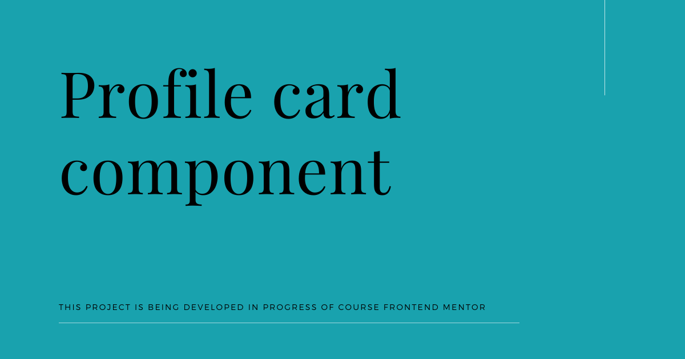
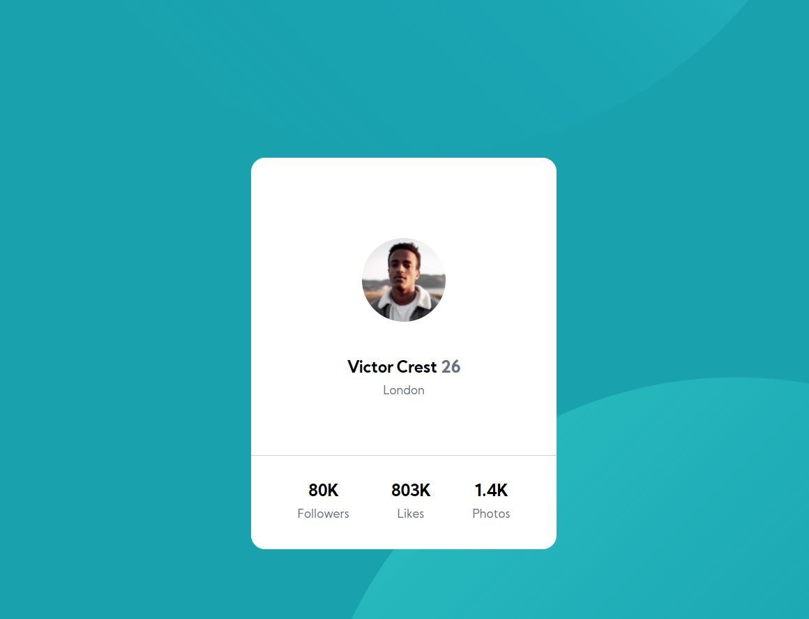

# Frontend Mentor | Profile card component

## Tabel of contents

- [General info](#general-info)
- [Technologies](#technologies)
- [Setup](#setup)
- [Demo](#demo)
- [Features](#features)
- [To-do list](#to-do-list)
- [Status](#status)
- [Sources](#sources)
- [Contact](#contact)

## General info

This project is being developed in progress of course Frontend Mentor | Profile card component and was created with the representation of the graphics from the photo. Its purpose is to learn the basics of the frontend and this website was created to show this knowledge in practice.

## Technologies

- HTML 5
- SASS -SCSS
- BEM
- webpack

## Setup

In console type `npm install` then choose one of the options:

`npm run start` - runs development mode

`npm run build` - runs build process for production

`npm run publish` - runs build process and publish the page using `gh-pages` branch

## Demo

Demo version of this project: [Link](https://skalutki.github.io/Frontend_mentor_Profile_card/)

## Features

- mapping graphics from the photo

## To-do list:

- mobile version (media queries)
- fixt svg position in background

## Status

Project is: in progress, I'm still learning JS and trying to use new knowledge in practice!

## Sources

- This web is inspire by Maciej Korsan and tutorial by [WTF: Co ten frontend](https://cotenfrontend.pl/)
- This web is inspire by Frontend Mentor by [Frontend Mentor](https://www.frontendmentor.io/challenges/profile-card-component-cfArpWshJ)

## Contact

Created by skalutki <skalutki@gmail.com> - feel free to contact me!
